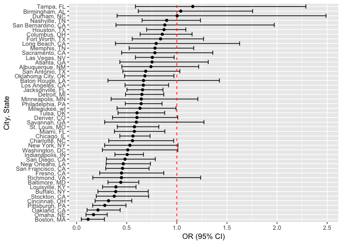
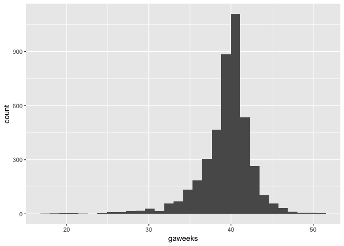
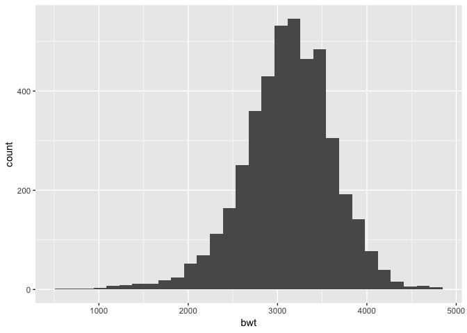
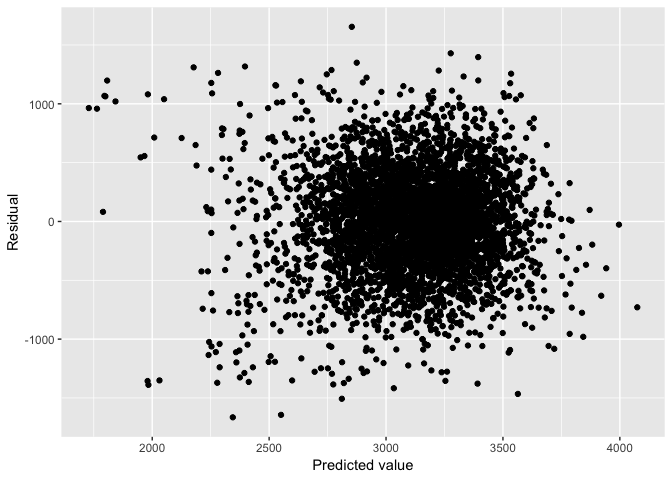
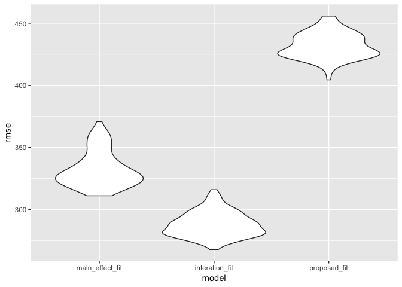

P8105\_hw6\_ykk2116
================
Yaa Klu
11/26/2018

**Loading
    packages**

``` r
library(tidyverse)
```

    ## ── Attaching packages ─────────────────────────────────────── tidyverse 1.2.1 ──

    ## ✔ ggplot2 3.0.0     ✔ purrr   0.2.5
    ## ✔ tibble  1.4.2     ✔ dplyr   0.7.6
    ## ✔ tidyr   0.8.1     ✔ stringr 1.3.1
    ## ✔ readr   1.1.1     ✔ forcats 0.3.0

    ## ── Conflicts ────────────────────────────────────────── tidyverse_conflicts() ──
    ## ✖ dplyr::filter() masks stats::filter()
    ## ✖ dplyr::lag()    masks stats::lag()

``` r
library(modelr)
```

### Problem 1

Reading of data and data wrangling The variable city\_state depicts,
cities and the states they are in. for example, New York, NY. The
victim’s race was recategorized into non-white and whites (reference).
Victim’s age was also changed into a numeric variable. Lastly, an
indication of whethwe a homicide is solved or not was
created.

``` r
homicide = read_csv("https://raw.githubusercontent.com/washingtonpost/data-homicides/master/homicide-data.csv", col_names = TRUE) %>% 
  mutate(city_state = str_c(city, ",", " ", state),
         solved = if_else(disposition == "Closed by arrest", "resolved", "unresolved"),
         solved = fct_relevel(solved, "unresolved"),
         victim_race = tolower(victim_race),
         colpsd_victim_race = fct_collapse(victim_race, "non-white" = c("asian","black", "hispanic", "other", "unknown")),
         colpsd_victim_race = fct_relevel(colpsd_victim_race, "white"),
         victim_age = as.numeric(victim_age)) %>% 
  filter(!(city_state %in% c("Dallas, TX", "Phoenix, AZ", "Kansas City, MO", "Tulsa, AL")))
```

    ## Parsed with column specification:
    ## cols(
    ##   uid = col_character(),
    ##   reported_date = col_integer(),
    ##   victim_last = col_character(),
    ##   victim_first = col_character(),
    ##   victim_race = col_character(),
    ##   victim_age = col_character(),
    ##   victim_sex = col_character(),
    ##   city = col_character(),
    ##   state = col_character(),
    ##   lat = col_double(),
    ##   lon = col_double(),
    ##   disposition = col_character()
    ## )

    ## Warning in evalq(as.numeric(victim_age), <environment>): NAs introduced by
    ## coercion

The glm function was used to fit a logistic regression model using the
victim’s age, race and sex as predictor variables and the outcome
variable was: resolved or unresolved homicide.

The estimates and confidence intervals were also obtained.

``` r
baltimore = homicide %>% 
  filter(city_state == "Baltimore, MD")

baltimore_logistic = glm(solved ~ victim_age + victim_sex + colpsd_victim_race, data = baltimore, family = binomial())
```

Table

``` r
baltimore_logistic %>% broom::tidy() %>% 
  janitor::clean_names() %>% 
  mutate(OR = exp(estimate),
         lower_95_ci = exp(estimate - (1.96 * std_error)),
         upper_95_ci = exp(estimate + (1.96 * std_error))) %>% 
  filter(term == "colpsd_victim_racenon-white") %>% 
  select(OR, lower_95_ci, upper_95_ci) %>% 
  knitr::kable(digits = 2)
```

|   OR | lower\_95\_ci | upper\_95\_ci |
| ---: | ------------: | ------------: |
| 0.44 |          0.31 |          0.62 |

From the table above, the odds of a solved homicide case, comparing
whites to non-whites (adjusted for age and sex) is 0.44 with a 95%
confidence interval of (0.31, 0.62)

Running similar glms (as above) for each city.

``` r
cities_logistics = homicide %>% 
  #Selecting only the variables needed
  select(city_state, solved, victim_age, victim_sex, colpsd_victim_race) %>%
  #Making listcolumns to use for the iteration
  group_by(city_state) %>% 
  nest() %>% 
  #Using maps to iterate the glm and tidy functions
  mutate(models = map(.x = data, ~ glm(solved ~ victim_sex + colpsd_victim_race + victim_age, 
                                      family = binomial, data = .x)),
         models = map(models, broom::tidy)) %>% 
  select(-data) %>% unnest() %>% 
  filter(term == "colpsd_victim_racenon-white") %>% 
  mutate(OR = exp(estimate),
  # Calculating the 95% confidence intervals
         lower_95_ci = exp(estimate - (1.96*std.error)),
         upper_95_ci = exp(estimate + (1.96*std.error))) %>% 
  select(city_state, OR, lower_95_ci, upper_95_ci) %>% 
  #Organizing cities according to estimated OR. From lowest to highest
  mutate(city_state = reorder(city_state, OR))
```

A graph that shows the estimated odds ratios and confidence intervals
for each city

``` r
ggplot(cities_logistics, aes(x = city_state, y = OR )) + 
  geom_point() + 
  geom_errorbar(aes(ymin = lower_95_ci, ymax = upper_95_ci)) + 
  coord_flip() +
  geom_hline(aes(yintercept = 1.00), linetype = "dashed", color = "red") + 
  labs(
    y = "OR (95% CI)",
    x = "City, State"
  )
```

<!-- -->

The graph above shows that the odds ratios for most of the cities were
below 1.0. However, for Durham, NC is looked as if it was 1.0 and for
Tampa, Fl and Brimingham, AL, the odds ratios were greater than 1.0. The
confidence intervals were wide for most of them and contained 1.0,
indicating statistical isginficance. Regardless, it shows that in most
of the cities, it is highly likely that the odds of a homicide being
solved is lower for victims who were not Whites, compared to those who
were Whites.

### Problem 2

Loading in dataset and data wrangling.

``` r
child_df = read_csv("./data/birthweight.csv") %>% 
  mutate(babysex = as.factor(babysex),
         frace = as.factor(frace),
         mrace = as.factor(mrace),
         malform = as.factor(malform))
```

    ## Parsed with column specification:
    ## cols(
    ##   .default = col_integer(),
    ##   gaweeks = col_double(),
    ##   ppbmi = col_double(),
    ##   smoken = col_double()
    ## )

    ## See spec(...) for full column specifications.

``` r
filter_all(child_df, any_vars(is.na(.))) 
```

    ## # A tibble: 0 x 20
    ## # ... with 20 variables: babysex <fct>, bhead <int>, blength <int>,
    ## #   bwt <int>, delwt <int>, fincome <int>, frace <fct>, gaweeks <dbl>,
    ## #   malform <fct>, menarche <int>, mheight <int>, momage <int>,
    ## #   mrace <fct>, parity <int>, pnumlbw <int>, pnumsga <int>, ppbmi <dbl>,
    ## #   ppwt <int>, smoken <dbl>, wtgain <int>

``` r
sum(is.na(child_df))
```

    ## [1] 0

After data wrangling we see that there is not missing observations. The
outcome of interest here is birth weight, which is a continuous
variable. I choose a linear regression for this analysis because of the
continuous variable.

From prior knowledge (literature), I would like to look at a linear
regression model using birth weight as an outcome and gestational age as
a predictor. Birthweight is usually associated with gestational age. In
the same model, I would adjust for the following variables including;
baby’s sex, mother’s age at delivry, mother’s race, father’s race,
mother’s weight gain during pregnancy, and average number of cigarette
smoked per day during pregnancy.

Distribution of the outcome and predictor variables

Gestational
    age

``` r
ggplot(child_df, aes(x = gaweeks)) + geom_histogram()
```

    ## `stat_bin()` using `bins = 30`. Pick better value with `binwidth`.

<!-- -->

Birth
    weight

``` r
ggplot(child_df, aes(x = bwt)) + geom_histogram()
```

    ## `stat_bin()` using `bins = 30`. Pick better value with `binwidth`.

<!-- -->

Birth weight looks like a normal distribution whiles gestational age
shows somewhat a left skew.

Fitting linear
model

``` r
proposed_fit = lm(bwt ~ gaweeks + babysex + momage + mrace + frace + wtgain +  smoken, data = child_df)

proposed_fit %>% 
  broom::tidy() 
```

    ## # A tibble: 13 x 5
    ##    term        estimate std.error statistic   p.value
    ##    <chr>          <dbl>     <dbl>     <dbl>     <dbl>
    ##  1 (Intercept)   872.      92.5      9.42   7.01e- 21
    ##  2 gaweeks        54.9      2.15    25.6    1.76e-134
    ##  3 babysex2      -86.1     13.1     -6.55   6.58e- 11
    ##  4 momage          4.81     1.83     2.62   8.71e-  3
    ##  5 mrace2       -214.      72.9     -2.94   3.29e-  3
    ##  6 mrace3       -162.     114.      -1.43   1.53e-  1
    ##  7 mrace4       -106.      71.2     -1.48   1.38e-  1
    ##  8 frace2        -62.9     72.9     -0.863  3.88e-  1
    ##  9 frace3        -41.8    110.      -0.381  7.03e-  1
    ## 10 frace4        -68.0     70.7     -0.963  3.36e-  1
    ## 11 frace8         -6.15   117.      -0.0525 9.58e-  1
    ## 12 wtgain          9.28     0.610   15.2    5.69e- 51
    ## 13 smoken        -11.4      0.917  -12.4    7.62e- 35

``` r
child_df %>% 
  modelr::add_predictions(proposed_fit) %>% 
  modelr::add_residuals(proposed_fit) %>% 
  ggplot(aes(x = pred, y = resid)) + geom_point() +
  labs(x = "Predicted value", 
       y = "Residual")
```

<!-- -->

Two other models

``` r
main_effect_fit = lm(bwt ~ blength + gaweeks, data = child_df)

interation_fit = lm(bwt ~ bhead * blength *babysex, data = child_df)
```

Cross validation

``` r
set.seed(56)
cross_vd =
  crossv_mc(child_df, 100) %>% 
  mutate(train = map(train, as_tibble),
         test = map(test, as_tibble))
```

``` r
cross_validation = cross_vd %>% 
  mutate(main_effect_fit = map(train, ~ lm(bwt ~ blength + gaweeks, data = .x)),
         interation_fit = map(train, ~ lm(bwt ~ bhead * blength *babysex, data = .x)),
         proposed_fit = map(train, ~ lm(bwt ~ gaweeks + babysex + momage + mrace + frace + wtgain +  smoken, data = .x))) %>% 
  mutate(rmse_main_effect_fit = map2_dbl(main_effect_fit, test, ~ rmse(model = .x, data = .y)),
         rmse_interation_fit = map2_dbl(interation_fit, test, ~ rmse(model = .x, data = .y)),
         rmse_proposed_fit = map2_dbl(proposed_fit, test, ~ rmse(model = .x, data = .y)))
```

A violn plot comparing the rmse of the 3 models

``` r
cross_validation %>% 
  select(starts_with("rmse")) %>% 
  gather(key = model, value = rmse) %>% 
   mutate(model = str_replace(model, "rmse_", ""),
         model = fct_inorder(model)) %>% 
  ggplot(aes(x = model, y = rmse)) + geom_violin()
```

<!-- -->

A table showing the mean\_rmse of the 3 models

``` r
cross_validation %>% 
  select(starts_with("rmse")) %>% 
  gather(key = model, value = rmse) %>% 
  group_by(model) %>% 
  summarize(mean_rmse = mean(rmse)) %>% 
  arrange(mean_rmse) %>% 
  knitr::kable(digits = 2)
```

| model                   | mean\_rmse |
| :---------------------- | ---------: |
| rmse\_interation\_fit   |     288.07 |
| rmse\_main\_effect\_fit |     332.32 |
| rmse\_proposed\_fit     |     431.93 |

The output from the graph and table shows that the best model is the
model that contains the interaction term. My proposed fit was the worst
model (sad)
